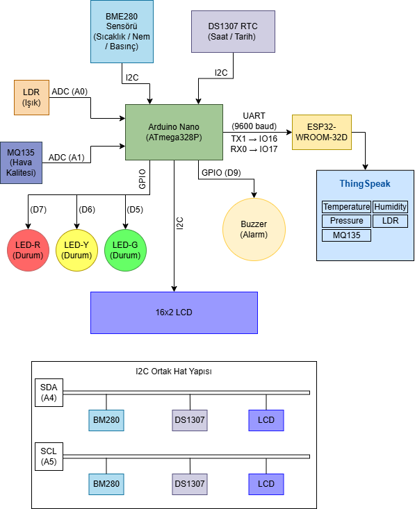

# TOBB ETÜ ELE362 - AVR Tabanlı Oda Ortam İzleme Sistemi

ATmega328P mikrodenetleyicisi kullanılarak geliştirilmiş çok sensörlü ortam izleme sistemi. Sıcaklık, nem, basınç, ışık ve hava kalitesi verilerini ölçer; LCD'de gösterir ve ThingSpeak'e iletir.


## İçindekiler

- [Proje Hakkında](#proje-hakkında)
- [Özellikler](#özellikler)
- [Donanım](#donanım)
- [Depo Yapısı](#depo-yapısı)
- [Kurulum](#kurulum)
- [Kullanım](#kullanım)
- [Ekran Görüntüleri](#ekran-görüntüleri)
- [Kaynaklar](#kaynaklar)

---

## Proje Hakkında

Bu proje, TOBB ETÜ ELE362/BIL362 Mikrodenetleyiciler dersi kapsamında geliştirilmiştir. Atmel Studio 7 kullanılarak register düzeyinde C ile yazılmıştır. Arduino kütüphanesi kullanılmamıştır.

---

## Özellikler

- BME280 ile sıcaklık, nem ve basınç ölçümü
- LDR ile ışık seviyesi ölçümü (ADC)
- MQ135 ile hava kalitesi ölçümü (ADC)
- DS1307 RTC ile gerçek zamanlı saat ve tarih
- 16x2 I2C LCD ekran üzerinde sensör verisi gösterimi
- Kırmızı/Sarı/Yeşil LED ile ortam durum göstergesi
- Eşik aşımında piezo buzzer ile sesli uyarı
- ESP32-WROOM-32D ile WiFi bağlantısı ve ThingSpeak'e veri gönderimi
- Tüm sürücüler (I2C, UART, ADC) sıfırdan register düzeyinde yazılmıştır

## Donanım

### Sistem Blok Diyagramı



### Bileşenler

| Bileşen | Açıklama | Bağlantı |
|---|---|---|
| ATmega328P (Arduino Nano) | Ana mikrodenetleyici | - |
| BME280 | Sıcaklık / Nem / Basınç sensörü | I2C - A4/A5 (0x76) |
| DS1307 RTC Modülü | Gerçek zamanlı saat | I2C - A4/A5 (0x68) |
| 16x2 LCD (I2C) | Ekran | I2C - A4/A5 (0x27) |
| LDR | Işık sensörü | ADC - A0 |
| MQ135 | Hava kalitesi sensörü | ADC - A1 |
| LED (K/S/Y) | Durum göstergesi | GPIO - D5/D6/D7 |
| Buzzer | Sesli uyarı | GPIO - PB1 |
| ESP32-WROOM-32D | WiFi modülü | UART — D0/D1 |

### Gerekli Ekstra Bileşenler

- CR2032 pil (DS1307 yedek güç)
- 4.7kΩ pull-up dirençler (DS1307 - I2C hattı)
- 1kΩ + 2kΩ direnç (ESP32 RX gerilim bölücüsü — Arduino TX 5V → 3.3V)

---

## Depo Yapısı

```
room-monitor/
├── code/
│   ├── atmega328p/         # ATmega328P kaynak kodları (Atmel Studio 7)
│   │   ├── main.c
│   │   ├── config.h        # Eşik değerleri
│   │   ├── secrets.h       # WiFi ve ThingSpeak kimlik bilgileri — GİT'E EKLENMEMELİ
│   │   ├── i2c.c / i2c.h
│   │   ├── bme280.c / .h
│   │   ├── ds1307.c / .h
│   │   ├── lcd.c / lcd.h
│   │   ├── adc.c / adc.h
│   │   ├── uart.c / uart.h
│   │   ├── gpio.c / gpio.h
│   │   └── legacy/         # ESP8266 AT komut denemesi (kullanılmıyor)
│   │       ├── esp8266.c
│   │       └── esp8266.h
│   └── esp32/              # ESP32-WROOM-32D kodu (Arduino IDE)
│       └── esp32_thingspeak.ino
├── images/
│   ├── blok-diyagrami.png
│   └── thingspeak(1-5).png
├── report/
├── .gitignore
└── README.md
```
---

## Kurulum

### ATmega328P (Atmel Studio 7)

1. Repoyu klonla:
```bash
   git clone https://github.com/inaneda/ELE362-room-monitor
```
2. `code/esp32/config.h` dosyasını aç, WiFi SSID/şifre ve ThingSpeak API anahtarını gir
3. Atmel Studio 7'de `code/atmega328p/` klasörünü proje olarak aç
4. Arduino as ISP bağlantısını kur (SCK/MISO/MOSI/SS)
5. Derle ve Arduino Nano'ya yükle

### ESP32-WROOM-32D (Arduino IDE)

1. Arduino IDE'de `code/esp32/esp32_thingspeak.ino` dosyasını aç
2. Board: `ESP32 Dev Module` seç
3. ESP32'yi USB ile bağla, derle ve yükle
 
---

## Kullanım

Sistem açıldığında:

1. BME280 başlatma kontrolü yapılır
2. Tarih ve saat 4 saniye LCD'de gösterilir
3. Ana döngü başlar — 4 sayfa arasında geçiş yapılır:
   - **Sayfa 1:** Tarih ve saat
   - **Sayfa 2:** Sıcaklık, nem ve saat
   - **Sayfa 3:** Işık seviyesi ve hava kalitesi
   - **Sayfa 4:** Sistem durumu (NORMAL / UYARI / ALARM)
4. Her ~16 saniyede bir ThingSpeak'e veri gönderilir

**Eşik Değerleri** (`config.h`):

| Parametre | Min | Max |
|---|---|---|
| Sıcaklık | 18°C | 28°C |
| Nem | %30 | %70 |
| MQ135 (ADC) | - | 650 |

---

## Ekran Görüntüleri

### ThingSpeak Kanal Verileri


*Alan 1 — Sıcaklık (°C)*


*Alan 2 — Nem (%)*


*Alan 3 — Basınç (hPa)*


*Alan 4 — Işık (ADC)*


*Alan 5 — Hava Kalitesi (ADC)*

---

## Kaynaklar

| Kaynak | Bağlantı |
|---|---|
| BME280 Veri Sayfası | https://www.bosch-sensortec.com/media/boschsensortec/downloads/datasheets/bst-bme280-ds002.pdf |
| DS1307 Veri Sayfası | https://datasheets.maximintegrated.com/en/ds/DS1307.pdf |
| ESP8266 Veri Sayfası | https://www.espressif.com/sites/default/files/documentation/0a-esp8266ex_datasheet_en.pdf |
| ESP32-WROOM-32D Veri Sayfası | https://www.espressif.com/sites/default/files/documentation/esp32-wroom-32_datasheet_en.pdf |
| ATmega328P Veri Sayfası | https://ww1.microchip.com/downloads/en/DeviceDoc/ATmega48A-PA-88A-PA-168A-PA-328-P-DS-DS40002061B.pdf |
| ThingSpeak Dokümantasyonu | https://www.mathworks.com/help/thingspeak/ |
| Seeed Studio ESP8266 Wiki | https://wiki.seeedstudio.com/WiFi_Serial_Transceiver_Module/ |
| ESP32 Arduino Kütüphanesi | https://github.com/espressif/arduino-esp32 |

---

**Eda İnan - TOBB ETÜ Elektrik-Elektronik Mühendisliği - Bahar, 2026**

